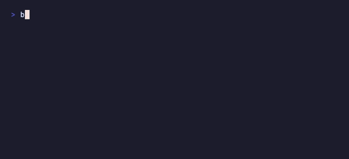

# blaeckfetch

A fast, minimalist system fetch for your terminal. Written in Rust. Powered by [blaeck](https://github.com/gustafeden/blaeck) for rendering.

## Default mode



Clean moon logo with essential system info. Shows OS, Kernel, Uptime, Shell, CPU, and Memory by default — no palette, no clutter.

Everything is customizable:

```toml
# Use any logo
logo = "arch"                          # built-in: apple, linux, ubuntu, arch, debian, fedora, moon
logo_file = "~/.config/blaeckfetch/logo.txt"  # or your own ASCII art

# Pick your fields
fields = ["OS", "CPU", "GPU", "Memory", "Disk (/)", "Local IP"]

# Show the color palette
palette = true

# Change colors
color = "cyan"

[colors]
title = [255, 165, 0]
label = "cyan"
separator = "dark_gray"
logo = "magenta"

# Rename fields
[labels]
"Disk (/)" = "Disk"
"Local IP" = "IP"
```

Available fields: `OS`, `Host`, `Kernel`, `Uptime`, `Packages`, `Shell`, `Resolution`, `DE`, `WM`, `WM Theme`, `Terminal`, `CPU`, `GPU`, `Memory`, `Disk (/)`, `Local IP`

Available colors: `green`, `cyan`, `red`, `magenta`, `yellow`, `blue`, `mono` — or use RGB arrays like `[255, 165, 0]`

## Splash mode

Launch blaeckfetch with an animated starfield background — a retro console-inspired splash screen.


Use a custom background image (PNG/JPEG) or the procedural starfield with earth and moon. Press any key to dismiss, or it auto-closes after the configured timeout. Perfect for shell startup animations.

## Performance

| Tool | Time |
|------|------|
| **blaeckfetch** | **~7ms** |
| neofetch | ~400ms |

~57x faster than neofetch. Uses a boot-cycle cache for static fields — first run after reboot is ~40ms, every run after that is ~7ms.

## Install

### macOS

```sh
brew tap gustafeden/tap && brew install blaeckfetch
```

### Arch Linux

```sh
yay -S blaeckfetch-bin
```

### Linux / macOS (installer script)

No Rust required — prebuilt binaries for macOS and Linux:

```sh
curl -fsSL https://gustafeden.github.io/blaeckfetch/install.sh | bash
```

Supports macOS (Intel + Apple Silicon) and Linux (x86_64 + aarch64). Downloads a prebuilt binary to `~/.local/bin` (or the first writable directory in your `$PATH` under `$HOME`).

To install a specific version:

```sh
BLAECKFETCH_VERSION=0.3.0 curl -fsSL https://gustafeden.github.io/blaeckfetch/install.sh | bash
```

### From source

```sh
git clone https://github.com/gustafeden/blaeckfetch
cd blaeckfetch
cargo build --release
./target/release/blaeckfetch
```

Or with cargo:

```sh
cargo install --git https://github.com/gustafeden/blaeckfetch
```

## Usage

```
blaeckfetch [OPTIONS]

Options:
  -c, --color <COLOR>    Color theme (green, cyan, red, magenta, yellow, blue, mono)
  -l, --logo <LOGO>      Logo to display (apple, linux, ubuntu, arch, debian, fedora, none)
      --logo-file <PATH> Path to custom ASCII art file
      --no-logo          Hide the logo
      --json             Output as JSON
      --clear-cache      Clear the cache and re-gather all info
      --config <PATH>    Path to config file
      --print-config     Print default config to stdout
      --mode <MODE>      Display mode (default, neofetch, splash)
      --splash           Splash screen mode (retro console animation)
      --neofetch         Neofetch-style layout (homage mode)
      --left             Splash screen alignment: left (default)
      --center           Splash screen alignment: center
      --right            Splash screen alignment: right
      --animate          Animate the logo (color cycling)
  -h, --help             Print help
  -V, --version          Print version
```

CLI flags override config file values.

### Color themes

`green` (default), `cyan`, `red`, `magenta`, `yellow`, `blue`, `mono`

```sh
blaeckfetch -c cyan
blaeckfetch -c red
```

### Logos

Auto-detected by OS. Override with `--logo`:

`apple`, `linux`, `ubuntu`, `arch`, `debian`, `fedora`, `none`

```sh
blaeckfetch --logo arch
blaeckfetch --no-logo
```

### Custom ASCII art

Use any text file as a logo:

```sh
blaeckfetch --logo-file ~/my-logo.txt
```

Or set it in the config:

```toml
logo_file = "~/.config/blaeckfetch/logo.txt"
```

### Splash mode

A retro console-inspired splash animation. Shows a starfield with earth and moon by default, or a custom background image. Press any key to dismiss, or it auto-closes after the configured timeout.

```sh
blaeckfetch --splash
blaeckfetch --splash --center
```

Add it to your shell RC file (`.zshrc`, `.bashrc`) for a startup splash.

#### Background image

Point `[splash] image` at a PNG or JPEG to use it as the background. Images are converted to half-block characters (`▄▀█`) with full RGB color — every cell packs two vertical pixels using foreground and background colors. The conversion is pure Rust with no external tools. Three stretch modes control how the image fits the canvas: `fill` stretches to fit, `fit` letterboxes to preserve aspect ratio, `crop` fills and trims the edges.

```toml
[splash]
image = "~/.config/blaeckfetch/space.png"
stretch = "fill"        # fill, fit, or crop
```

Without an image, blaeckfetch renders a procedural starfield with earth and moon.

#### Full-resolution image mode

Terminals that support inline images (iTerm2, WezTerm, Ghostty, kitty) can render the background at full pixel resolution instead of half-block ASCII. blaeckfetch auto-detects this — no config needed.

To force a specific mode:

```toml
[splash]
render_mode = "image"   # force inline image (iTerm2 protocol)
render_mode = "ascii"   # force half-block characters
render_mode = "auto"    # auto-detect (default)
```

Limitations:
- Inline image mode uses the iTerm2 image protocol. Terminals that don't support it will show nothing — use `render_mode = "ascii"` as a fallback.
- Image resizes on terminal resize may briefly flicker.
- VHS and screen recorders capture the half-block fallback, not the inline image.

#### Splash config reference

| Key | Type | Default | Description |
|-----|------|---------|-------------|
| `image` | string | — | Path to background image (PNG/JPEG) |
| `stretch` | string | `"fill"` | `fill` (stretch), `fit` (letterbox), `crop` |
| `width` | int | auto/68 | Canvas width in columns |
| `height` | int | auto/23 | Canvas height in rows |
| `timeout` | int | `120` | Seconds before auto-close |
| `star_brightness` | int | `30` | Star detection threshold (0-255) |
| `render_mode` | string | `"auto"` | `auto` (detect terminal), `image` (force iTerm2), `ascii` (force half-block) |
| `align` | string | `"left"` | `left`, `center`, or `right` (CLI flags override) |
| `min_width` | int | `10` | Minimum canvas width in columns |
| `min_height` | int | `5` | Minimum canvas height in rows |
| `max_width` | int | — | Maximum canvas width in columns |
| `max_height` | int | — | Maximum canvas height in rows |
| `entrance` | string | `"slow"` | Entrance animation: `slow` (~1.2s), `fast` (~400ms), `instant` |
| `exit` | string | `"slow"` | Exit animation: `slow` (~400ms), `fast` (~200ms), `instant` |

Note: The config section name `[boot]` still works as an alias for `[splash]` for backward compatibility.

### Neofetch mode

An homage to the classic neofetch layout. Run with `--neofetch` or `--mode neofetch` for the traditional side-by-side logo + info display:

```sh
blaeckfetch --neofetch
```

Or set it in your config:

```toml
mode = "neofetch"
```

blaeckfetch started as a fast alternative to neofetch, and this mode preserves that layout. The default mode has since evolved into its own minimal identity.

### JSON output

```sh
blaeckfetch --json
```

### Configuration

blaeckfetch loads config from `~/.config/blaeckfetch/config.toml`. Generate a default config:

```sh
blaeckfetch --print-config > ~/.config/blaeckfetch/config.toml
```

Example config:

```toml
color = "cyan"
logo = "arch"
palette = false
separator = "="

# Show only these fields, in this order
fields = [
    "OS",
    "CPU",
    "Memory",
    "Disk (/)",
]

# Rename fields
[labels]
"Disk (/)" = "Disk"
"Local IP" = "IP"

# Custom colors (named or RGB)
[colors]
title = [255, 165, 0]
label = "cyan"
```

Config options:

| Key | Type | Description |
|-----|------|-------------|
| `mode` | string | Display mode: `"default"`, `"neofetch"`, `"splash"` |
| `color` | string | Color theme name |
| `logo` | string | Logo name or `"auto"` |
| `logo_file` | string | Path to custom ASCII art file |
| `palette` | bool | Show color palette (default: true) |
| `separator` | string | Separator character (default: `"-"`) |
| `fields` | list | Fields to show, in order |
| `labels` | table | Rename any field label |
| `colors.title` | string/rgb | Title color |
| `colors.label` | string/rgb | Label color |
| `colors.separator` | string/rgb | Separator color |
| `colors.logo` | string/rgb | Logo color |

Color values can be a named color (`"cyan"`, `"light_red"`, etc.) or an RGB array (`[255, 165, 0]`).

## Fields

| Field | macOS | Linux |
|-------|-------|-------|
| OS | version + arch | distro + arch |
| Host | hardware model | DMI product name |
| Kernel | Darwin version | Linux version |
| Uptime | days, hours, mins | days, hours, mins |
| Packages | brew | dpkg, pacman, rpm, flatpak, snap |
| Shell | name + version | name + version |
| Resolution | CoreGraphics API | - |
| DE | Aqua | XDG_CURRENT_DESKTOP |
| WM | Quartz Compositor | XDG_SESSION_TYPE |
| WM Theme | accent color + dark/light | GTK theme |
| Terminal | TERM_PROGRAM | TERM_PROGRAM |
| CPU | model + core count | model + core count |
| GPU | SoC name | lspci VGA |
| Memory | used / total MiB | used / total MiB |
| Disk | root filesystem GiB | root filesystem GiB |
| Local IP | first non-loopback IPv4 | first non-loopback IPv4 |

## How it's fast

- Compiled Rust binary — no interpreter startup
- Direct syscalls for host model, disk stats, display resolution (no subprocess spawning)
- Boot-cycle cache (`~/.cache/blaeckfetch/cache`) for fields that don't change between reboots
- Only two subprocess calls on macOS (`defaults read` for theme), and those are cached
- sysinfo crate for memory/CPU instead of parsing command output

## Dependencies

- [blaeck](https://github.com/gustafeden/blaeck) — inline terminal UI framework
- [sysinfo](https://crates.io/crates/sysinfo) — cross-platform system information
- [clap](https://crates.io/crates/clap) — CLI argument parsing
- [image](https://crates.io/crates/image) — image loading and processing (splash mode backgrounds)

## Releasing

1. Bump `version` in `Cargo.toml` and `installer/Cargo.toml`
2. Commit: `git commit -am "v0.2.0"`
3. Tag and push: `git tag v0.2.0 && git push && git push origin v0.2.0`

GitHub Actions builds binaries for macOS/Linux (Intel + ARM) and creates the release.

## License

MIT
